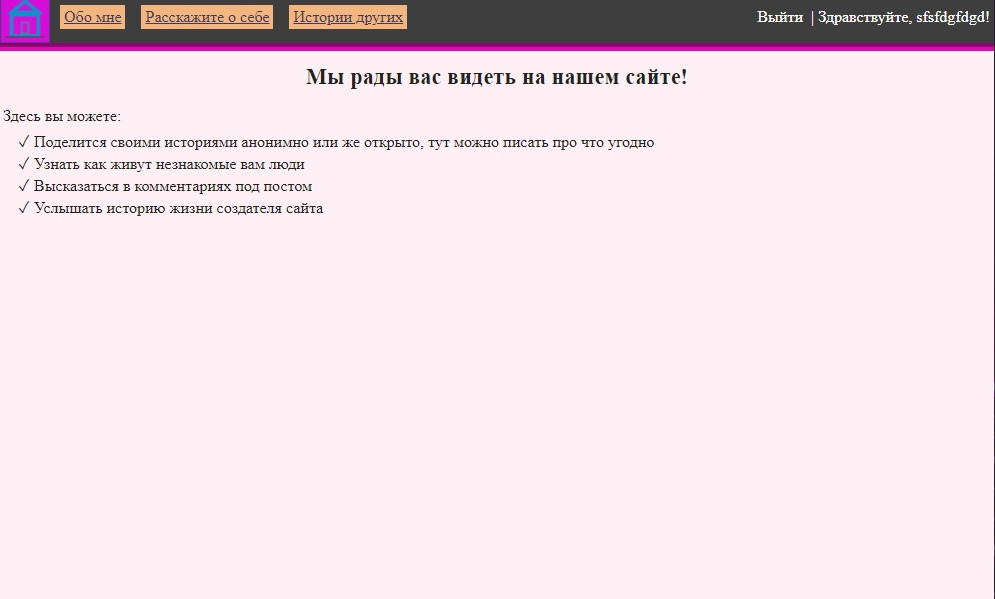
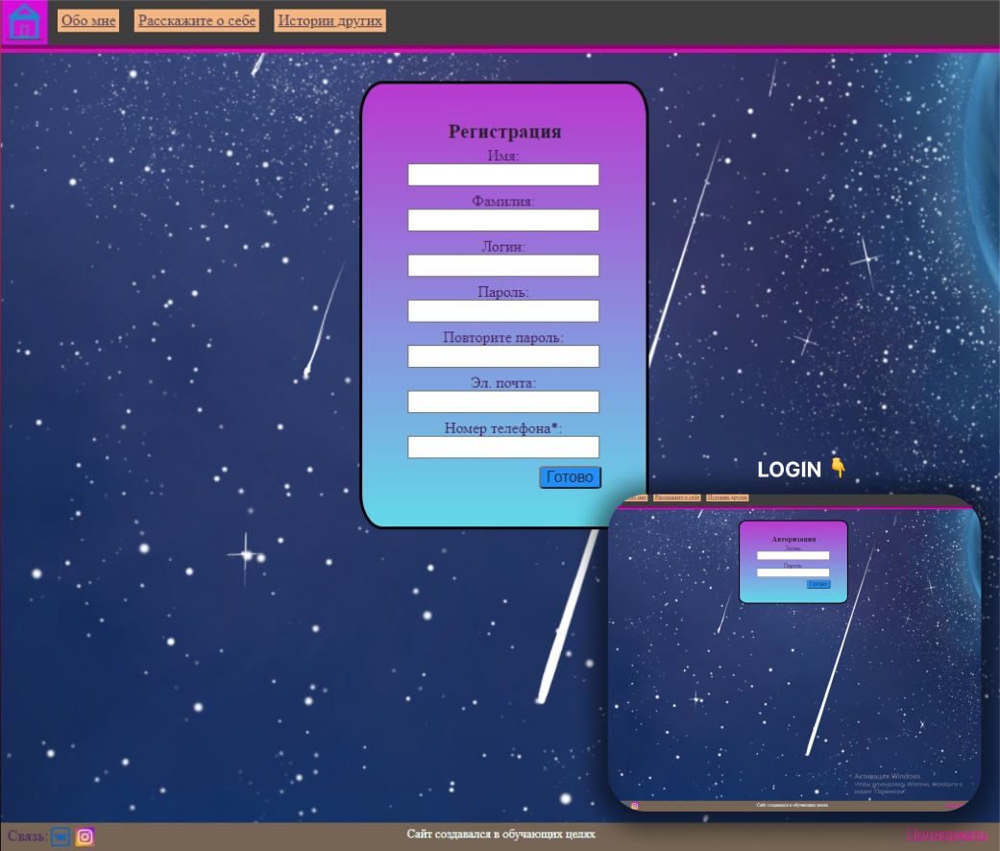
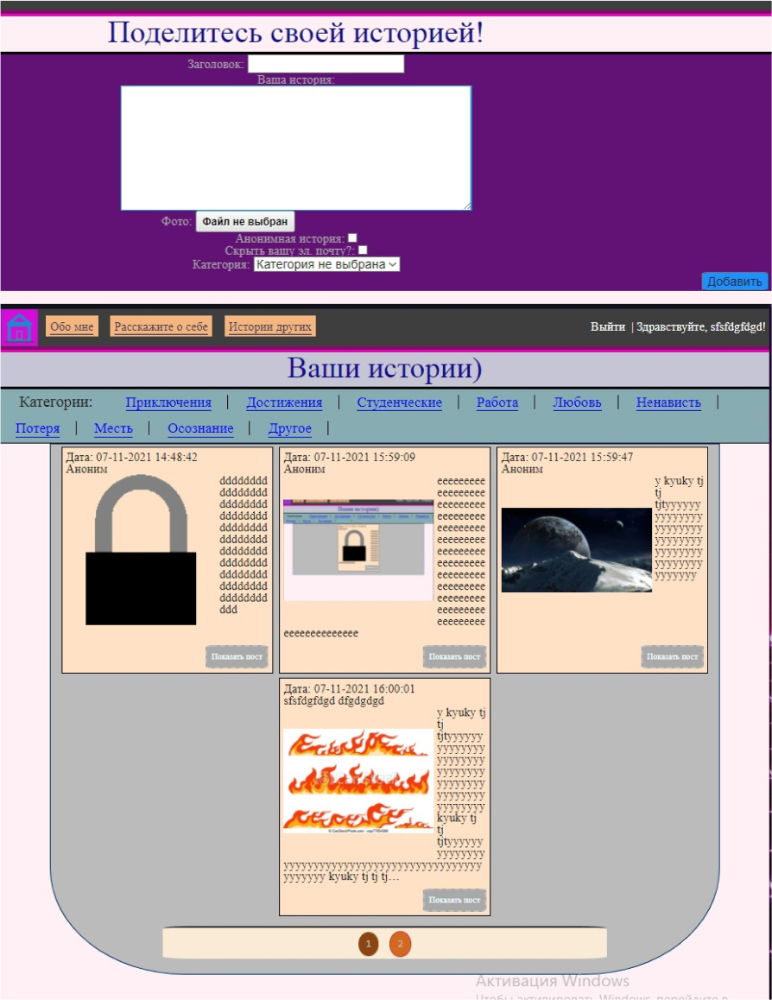

Меня зовут Прасолов Вадим Александрович. Я уроженец города Оренбург, родился 17 декабря 2006 года. Я был достаточно спокойным ребенком, без какого особого характера. Жил(и на момент написания все еще живу) в полноценной семье обычных рабочих людей, которые по типу, целям, стремлениям никогда не подходили мне. Я остаюсь ими доволен, доля того кем я стал и становлюсь их заслуга.

## Отношение к школе

_Школа..._ Сколько наверное воспоминаний у людей связанно с этим местом. Думаю, что многие из нас жалеют о чем-либо сделанным или же не сделанным. Я часто слышу от людей истории о том, какой бессмысленной ерундой они там только не занимались. В своей школе среди одноклассников никогда не видел талантов к чему либо серьезному. Ужас! Среди 26 человек в классе! Точно не знаю как насчет параллельных классов, но вроде там ситуация та же. Никто ни к чему сильно не стремился, не придумывал планы.

Сейчас я расскажу почему я не как они. Где-то до 7 класса я как бы был под влиянием этого тупорылого окружения и задумывался о том, правильно ли я поступаю, что не прекращаю с ними общаться. К 8 классу я осознал многое и оборвал отношения с неправильным окружением(сделать это раньше было бы лучше, но сомнения мне мешали), они мне стали безразличны и не оказывали теперь на меня влияния. Мне стало намного легче на душе от этого. Я был рад и даже стал больше наслаждаться своей жизнью, хоть и ловил хейт от них на который мне было плевать.

С одной стороны от школьников ожидать чего-то особенного очень глупо, тк они дальше сверстников не хотят уходить. Но если смотреть с другой стороны, то они обладают большим арсеналом преимуществ:

- Обеспечение семьей
- Молодость и склонность к обучению
- Любопытство
- Быстрое приспособление
- Лояльные условия от окружения
- Склонность к современным технологиям

Используя их можно быть в неплохом профите.

Но одним из серьёзных препятствий остается то, что общество навязывает детям, что они не могут принести никакой пользы, пока не выполнят некоторые действия и(или) не достигнут определенного возраста. По этой причине многие даже не пытаются проявить себя в раннем возрасте и доверяют себя кому-либо на обучения не пойми чего и зачем.

Хочется отметить и то, что благодаря своей податливости многие студенты общеобразовательных заведений попадают на всякие зависимости по типу: сигарет; алкоголя; игромания; просмотра коротких роликов в интернете, которые не несут смысл и др. Многое не прошло стороной и меня, но я не испытывал никогда зависимости к чему-то плохому, тк понимал цену всего этого и в краткие сроки избавлял себя от этого. Мне просто искренне обидно за тех кто не может потом бросить 😔(лохи😁)

## Увлечения

### Смена пути

В 11-13 лет я начал заниматься спортом, а именно боксом. Я на тот момент больше любил тренироваться, чем драться в спаррингах. _- Уф ну сейчас бы не отказался снова подраться на ринге в перчатках_. За этот промежуток времени я закрепил спорт в своей жизни. Как итог я был там не так и плох, но все-таки мне не хватало ярости для этого вида спорта. Я задумывался об альтернативе... И вот чудо! Мне посоветовал лучший друг **Олег** поучиться программированию на Python и дал pdf файл популярной книги.

### Hello world! - Python 🐍

По началу я этот гребаный питон даже установить не смог, но мне помог его папа, который был программистом со стажем. После того как я разобрался с базой за 3 месяца, то есть прошел книгу, я был огорчен: "Блин и как на этом заработать? Кому вообще сдалось открывать терминал чтобы мой код выполнить?". Я был обижен на все это, но доволен тем фактом, что эту книгу прошел полностью, быстрее чем сам Олег 😼. После я решил попробовать делать игры на unity.

### Hello Unity

На Unity я сталкивался с огромной кучей ошибок, но как я понял они все решаемы, если быть настойчивым и не сдаваться. Как итог получилось смастерить игру-платформер. Посмотреть можно ниже 👇

<iframe width="100%" style={{aspectRatio: "16/9"}} src="https://www.youtube.com/embed/oaOaQrtoDRs" title="YouTube video player" frameborder="0" allow="accelerometer; autoplay; clipboard-write; encrypted-media; gyroscope; picture-in-picture; web-share" allowfullscreen></iframe>

Но я понял, что в гейм индустрии мне ничего не светит, по этим причинам:

1. Никто не помог бы сделать персонажей крутых с которыми бы я возился
2. Я был не готов сложные сценарии писать и их разрабатывать
3. Ресурсов хороших я много не нашел
4. Спроса на мои приложения я не представлял
5. Чтобы сделать крутую игру необходимо, иметь команду хорошую
6. Гугл плей заблокировал мой аккаунт вообще по непонятной причине, когда я пытался выложить(аккаунт стоил 25$, для меня тогда это были огромные потери)
7. Сложность дальнейшего продвижения в этой теме (гайдов крутых реально мало и они все базу только дают)

### Первый опыт web-программирования

На просторах интернета мне пригляделось веб направление. Я начал сначала искать курсы и в итоге нашел по css и html. После того как прошел их офигел как все простенько работает. Но все равно как сделать сайт с какой-то логикой не понимал. Наткнулся на такой инструмент как django. "О чудо! Не зря я python изучал!" - подумал я. Когда я понял возможности этого фреймворка приступил делать свой проект - "Тазик историй". Суть приложения была в том, что посетители могут оставлять на сайте свои истории, а к историям писать комментарии. Мне очень понравилось что в django было все так удобно: админка, пользователи, защита, авторизация и многое другое. Я был в восторге от удобства данного фреймворка для создания веб приложений, он многому меня научил и осведомил в вебе. Ниже я нашел пару скриншотов чтобы вы имели представление.

**Главная страница**

**Аутентификация**

**Форма создания историй и их отображение**

### Arduino

:::info К СВЕДЕНИЮ

**Arduino** — это электронный конструктор и удобная платформа быстрой разработки электронных устройств для новичков и профессионалов.

:::

Тот же друг Олег(который рекомендовал изучить мне программирование) решил подарить мне набор крутой набор для старта работы с электроникой. Вот тут я понимал что особо много профита не получу от этого занятия, но мне стало очень интересно и занимательно это изучать. Как обычно я изучал основы, экспериментировал и придумал какой проект можно сделать.

#### Интересные часы

Я решил что данный проект отразит базовые навыки, которые я приобрел в изучении Arduino и электроники в целом. У меня вышло придумать необычный функционал для часов. Постараюсь его вкратце сейчас описать.

Первое, что они делали - отображали время на дисплее. Там же периодически отображались данные о влажности воздуха и температуре, благодаря одному из датчиков. В задней части располагались кнопки. С их помощью можно было настроить время используя разные комбинации нажатий. К тому же я решил реализовать на часах спящий режим, в котором потребление электричества было мизерное. Спереди (там же, где и дисплей) расположился датчик движения, который, при срабатывании, включал экран часов. Вот такой у них был функционал

Я их делал 8 дней, за 2 дня написал код для них, а остальные 6 их паял и собирал 😌

**Расходники:**

- Датчик влажности и температуры － 1 шт.
- Датчик движения PIR － 1 шт.
- Модуль часов － 1 шт.
- Кнопки － 3 шт.
- Проводочки
- Макетная плата － 1 шт.
- Пластиковый корпус － 1 шт.

> Бюджета на аккумуляторы не было, поэтому все это питалось от блока питания по проводу🥲

**В таком виде я разрабатывал для них скрипт**

**Когда скрипт был готов и протестирован начал их паять 🔥**

**Вот так они выглядили в конце:**

Поздравляю! Вы теперь узнали о том, чем я занимался до создания мобильных приложений, думаю вам было интересно это читать, спасибо 🙃
