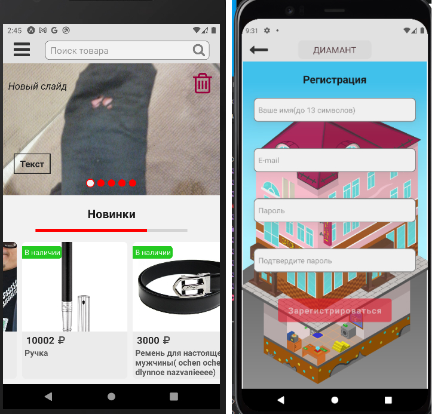
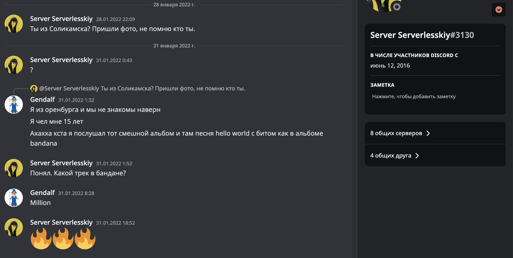
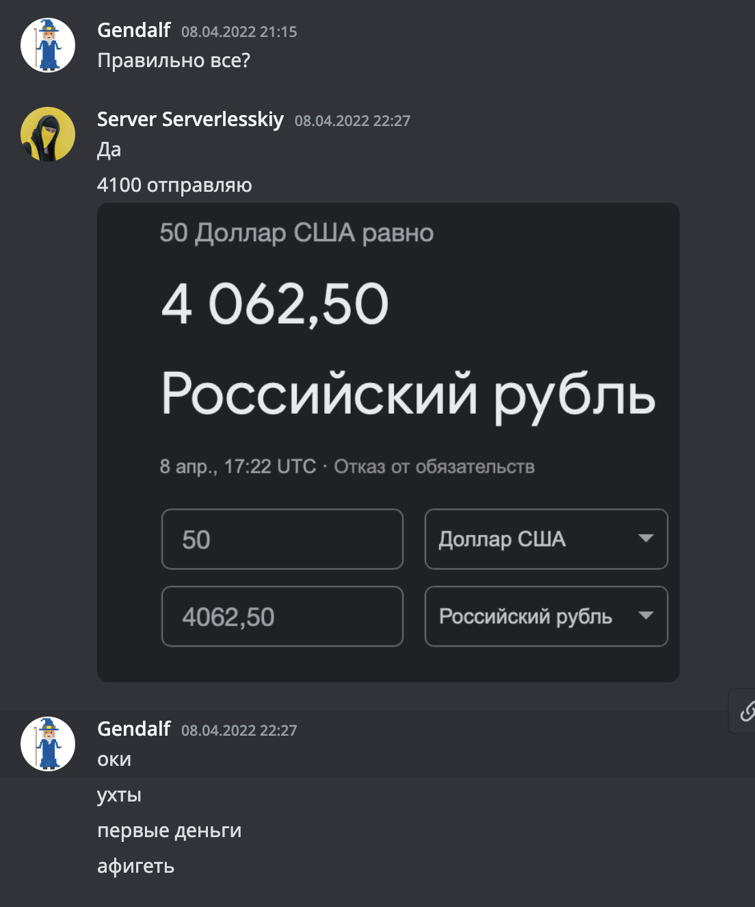

import ReactPlayer from 'react-player';

# Почему мой выбор направления IT снова поменялся?

Чтобы ответить на этот вопрос я задал себе другой: "Гений, а какой профит от всех твоих прошлых занятий?". Я хоть и делал что-то крутое, но мои родители постсоветского времени не смогли отличить мои занятия от обычных посиделках в играх.

Вправду, я был без понятия как мои все эти навыки можно было монетизировать. Тут ко мне пришла идея 💡. "А вот у местного ювелирного магазина есть сайт, но нет приложения, думаю оно было бы им очень кстати". К тому моменту моя мать работала там. Я считал что можно будет договориться с директором, если я продемонстрирую серьезный прототип и свои амбиции. Вот с такого импульса я полетел изучать тему мобильных приложений.

# Новые открытия 🔪🥫

> Я удивился тому какой тухлый и мерзкий JS в браузерном или HTML коде, по сравнению с тем какой он в мобильных приложениях

Взвесив возможности, сложности, спрос я понял что перспектив навалом. Я узнал, что ниша мобильных приложений:

- Не переполненна разными курсами
- Избавлена от разработчиков-старперов имеющих супер огромный стаж
- Не предоставляет очевидных учебных заведений
- Оптимизирует повторные действия разработчика

Мой взгляд при выборе инструмента для создания мобильных приложений сразу пал на React Native. По началу я запутался во всех гайдах и ничего не понимал. Со временем картина вырисовывалась все лучше и лучше для меня. Чтобы начать практику я потратил 1,5 месяца на изучение JS и всякие подготовительные этапы(настройка, анализ, составление планов обучения и тп).

## Первое приложение на Expo

И так, после изучения основ пытаясь и экспериментируя я сделал вот такое чудо 🌟:

<ReactPlayer controls url="/video/diamant-app.mp4" />

Еще фотки которые нашел:

> Мне удалось тогда интегрировать карты, создать некоторые анимации, настроить навигацию приложения (ой как долго я это сделать пытался...), подключить аутентификацию от сервисов AWS(отвратительный сервис у них). Весь дизайн сделан мною, в том числе и заставка. - "Горжусь и стыжусь"

Код этого приложения доступен здесь: [https://github.com/taZik616/diamant-my-first-rn-project](https://github.com/taZik616/diamant-my-first-rn-project)

Вы скорее всего не сможете запустить. Когда-нибудь я сделаю для него ветку с римейком рабочим 🤠

**- Стоп, и ты на этом закончил?** - Да)

## Hello, Dmitry

Первые сообщения 😹

Бросил я свою затею лишь потому что я нашел наконец-то себе наставника. На тот момент как раз была мечта найти взрослого наставника, который бы помог прокачать мои навыки и знания в обмен на мое время(платить чем то, кроме своего времени я не мог). Им стал разработчик с хорошим опытом. Он был основателем школы программирования JS Camp(ну, если честно, там просто детский сад). Я показал ему свое желание стать реальным программистом, выполняя всякие задания. Именно у него я перенял много знаний, практик и паттернов в программировании, которыми пользуюсь и по сей день. С ним у меня получилось уже использовать свои навыки с профитом! Я был рад, что в моих связях появился такой человек.

Первые деньги на этом я заработал именно у него. Это были 4 100₽, их я получил за рефакторинг кода и добавление новых штук в игре **Leela**, это заняло вроде-бы 2-3 недели. После еще нескольких работ, я выпросил его прислать мне его старый б/у macbook pro 2018 года. Этот macbook был мне необходим из-за его macOS. К сожалению, мой ПК на пиратском windows, который я получил от родителей, был ужасен по сравнению с этим ноутбуком. Я был рад и **все лето** работал на нем (почти целыми днями, не думая о выходных). Ну еще я за то время, пока работал, получил от него 5 000₽.

То чем я занимался летом:

- Игра Leela - [android](https://play.google.com/store/apps/details?id=com.leelagame) & [ios](https://apps.apple.com/us/app/игра-лила/id1296604457) - здесь я добавил онлайн часть и много чего еще
- JS Camp - [android](https://play.google.com/store/apps/details?id=com.sumerian) & [ios](https://apps.apple.com/ru/app/js-camp/id1526808075) - это приложение я делал почти с нуля (были только логотип и идея)📚
- Пробывал делать на next.js приложение для показа презентаций в формате MDX

Тогда, пожалуй, самым значимым опытом была совместная работа с наставником в компании Rightway. На этом этапе я стал по-другому относиться к созданию приложений. Теперь мне было понятно, что нужно качественно проектировать и обдумывать проект, прежде чем браться делать (что обычно я не делал). Меня познакомили со множеством организационных моментов в разработке: bitbucket, jira, code-standard, ветки github, коммерческим flow, ответственностью и др. Мне понравилось как в коммерческих компаниях работают над каждым процессом и этапом. Спринты на которые планирование выполнения задач, оперативная помощь, отчетность - все это было очень интересно для меня.

Например, я разобрался и сделал в этом приложении глубокие ссылки за него:

<ReactPlayer controls url="/video/member-deeplinks.mov" />

Так я понял: я теперь не студент-программист, а создатель полезных продуктов ⬆️
