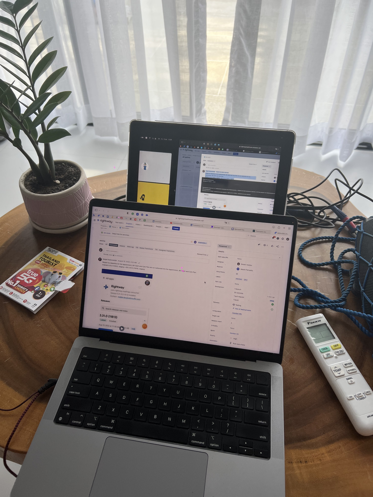

Здесь я расскажу о том как мой наставник устраивался на работу.

После того как он уволился с Rightway он начал искать работу получше. Он почему-то нацеливался на web3 проекты, хоть у него самого не было совсем никакого опыта там. Я конечно поддерживаю такой подход, но мой учитель такой себе программист. На самом деле он уже не испытывал любовь к своему делу, ему все там надоело. Однако, у него был я, который за него мог код написать. Это наверное ему помогло готовиться к поиску работы.

Он начал сразу ходить по вакансиям на hh.ru и LinkedIn, ему работодатели сами предлагали работу не плохую. Каждое собеседование было приятным по процессу, но многие были не удачные. Он использовал Loopback, чтобы я и парочка других его друзей могли ему подсказывать ответы, а также поставил ipad напротив макбука.

Это было весело и я понял насколько там все просто. Мне понравилась также доброта технических специалистов, проводящих собеседования. Они параллельно делились опытом при разговоре, и после провала скидывали полезные видео, материалы. Мне в общем нравиться сильно альтруизм в IT сфере 🫂

Все эти собеседования побудили меня изучить множество новых тем и создать списки распространенных вопросов (которые ввы можете найти в документации)

## Конфликт

Я думал, после того как он получит отличную работу, он будет более справедливо платить за мою работу. Но он хотел чтобы я еще больше макбук отрабатывали я посчитал это наглостью. Несмотря на то что я уже 3 месяца лета работал, учил его учеников и делал много чего полезного для него. Я решил, что я больше не вытерплю так работать и не ради этого я вообще в программирование шел. В итоге, из-за того что этот жмот не хотел мне платить больше 30к, я очень быстро ушел от него.

Не долго рыпаясь, я сам нашел себе работу, но меня даже не опрашивали и не собеседовали. Было обидно что я готовился сильно к собеседованию, а его и не было🥲
