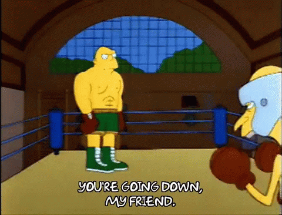
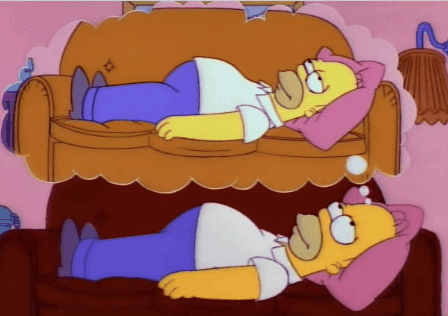
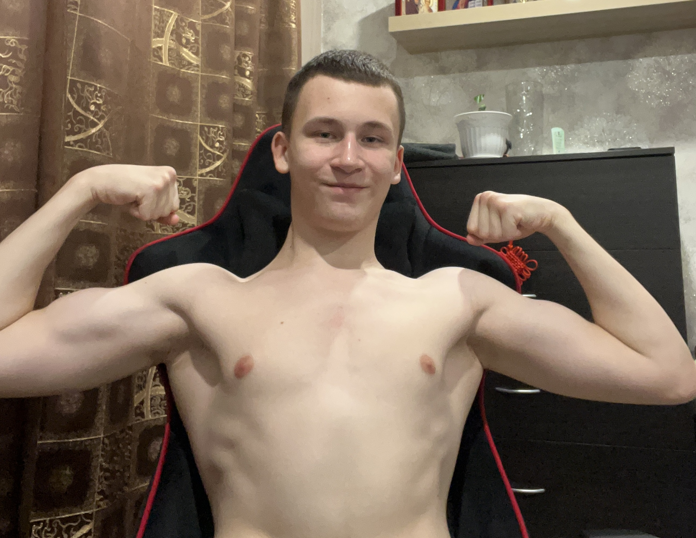

import ReactPlayer from 'react-player';

Сегодня я расскажу о спорте в моей жизни

Я в возрасте 11-14 лет занимался боксом, поэтому я решил это дело возобновить, когда уже научился программировать и купил экипировку для этого. Летом 2023 я начал с бега, тк это единственное чему хорошо научили еще тогда в бесплатных государственных спорт-секциях. Обычно я бегал от дома до центра и обратно. Общая дистанция выходила около 14 км.

#### Post-preparation

После подготовки я решил снова, перед запланированным переездом в Казань, походить на тренировки в ту секцию, где уже числился с 11 лет.

Я начал с того, что уговаривал тренера меня взять на бокс, тот вспомнил меня и сказал что тут якобы не проходной двор, я сказал что уже тут тренировался. Он еще сильнее пылал и давил, мол я наглец. Как итог, от того что я стоял в ступоре, он разрешил ходить на тренировки, чему я особо не удивился. Моего прошлого тренера к сожалению не было и спорт-зал был в ремонте, так что боксом мы особо не занимались, только был бег и упражнения. Как я понял тренеру было пофиг на тренировки, он просто давал задания и на летнем вайбе отдыхал в теньке или в главном здании.

#### Как я сгорел на боксе

Все шло хорошо: разминка, бег, гири, турники, круговые тренировки. Но вот не задача... **Футбол!** В раннем возрасте там тоже был футбол, что уже на тот момент раздражало. Главная проблема заключалась в том, что ты никогда точно не знаешь, когда голова тренера будет настроена провести футбол, а когда нормальную тренировку. В момент когда мы с другом Кириллом просили позаниматься на турниках вместо футбола, нам тренер жестко запретил с высокомерием. Мы были уже не детьми, поэтому нас это двоих задело. После тренировки я психанул и высказался на этот счет тренеру в ВК(тк он вечно где то близко, но далеко) и меня ответ в ментальный нокаут отправила.

> Потом я продолжал тренироваться на спорт площадках с Кириллом, бегая до места с боксерским мешком

#### Казань

После переезда в Казань, сразу на следующий день я нашел секцию для себя и записался. В тот же день пришел на пробное занятие и понял, что я тут на долго теперь.

На момент написания этой записи я там тренируюсь уже 4-ый месяц и мои боксерские навыки выросли достойно, интересно что будет через год-два, вот такой я щас:

Место проведения всех тренировок по боксу очень достойное:

<ReactPlayer controls url="/video/my-sport-section.mp4" />
