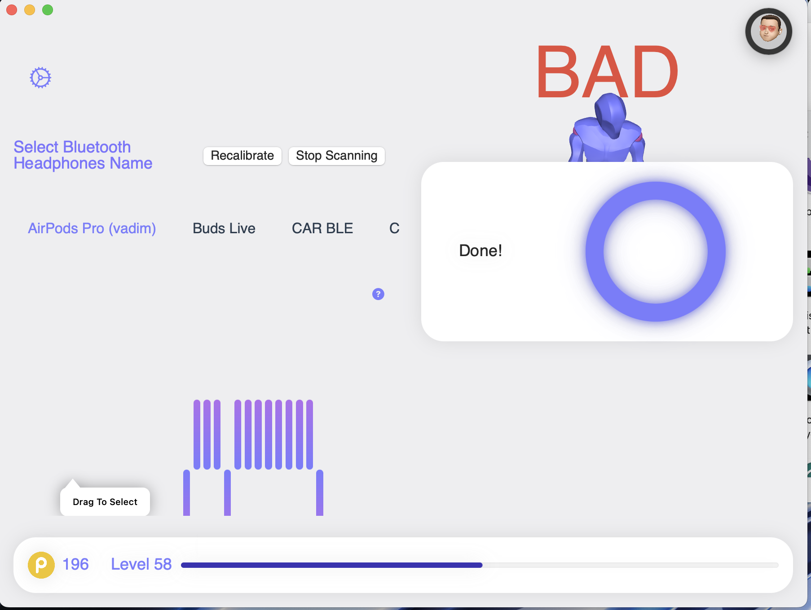
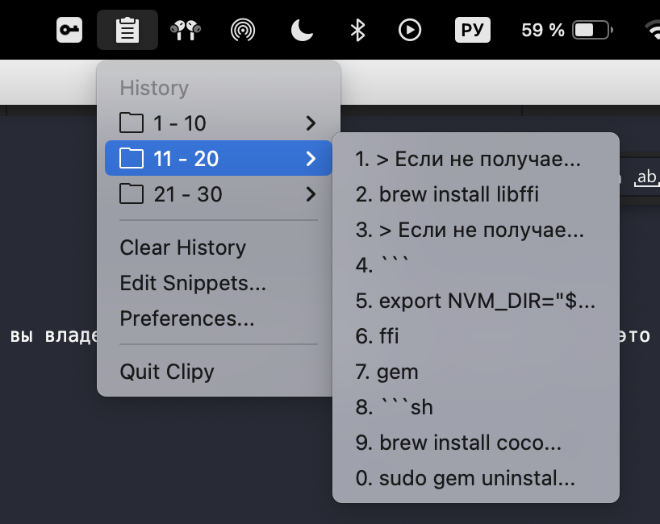
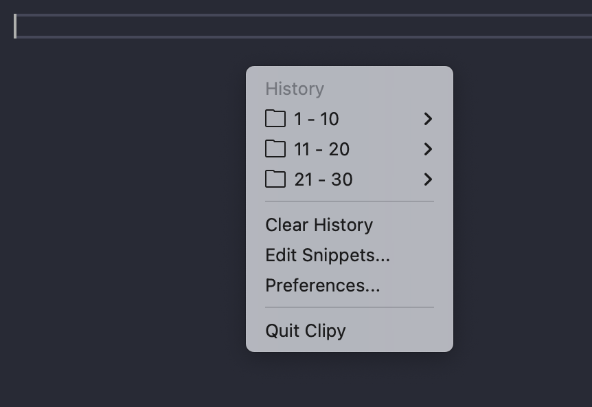
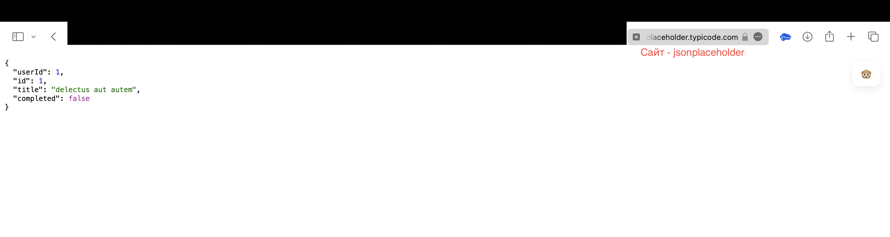

# Крутые утилиты для вашего mac

Здесь я буду делиться расширениями, которыми на мой взгляд могут быть полезны

1. [**PodPosture**](https://apps.apple.com/us/app/podposture-posture-improver/id1550684595) (free) - если вы владелец AirPods Pro и сутулитесь за работой, то это приложение поможет вам сохранить эстетичность спины, отслеживая положение вашей головы по датчикам в ваших наушниках

Как я понял тут можно откалибровать положение вашей головы, запустив калибровку и на время застыть

2. [**Clipy**](https://clipy-app.com) (free) - приложение с открытым исходным кодом, которое сохраняет историю скопированных текстов и помогает их переиспользовать

К нему можно обратиться нажав комбинацию клавиш ⇧(shift) + ⌘(command) + пробел

3. [**JSONPeep**](https://apps.apple.com/ru/app/json-peep-for-safari/id1458969831?mt=12) (free) - расширение safari, форматирует JSON ответы прямо в браузере

