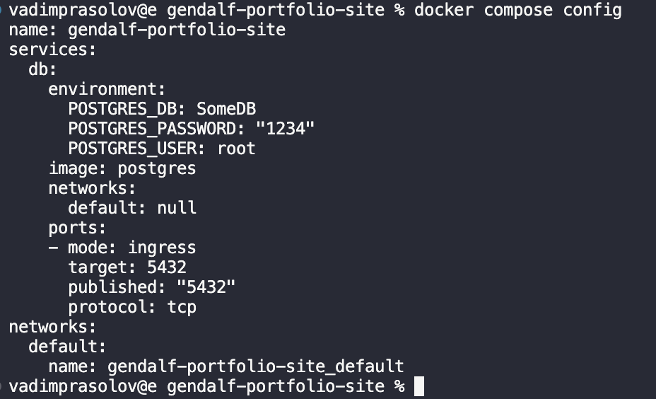

# Использование docker-compose

Использование Compose - обычно трехэтапный процесс:

1. Подготовка среды вашего приложения с помощью Dockerfile
2. Запись служб необходимых вашему приложению в docker-compose.yml
3. Запуск `docker compose up` в корне проекта

Рассмотрим этот простой пример:

```yml
version: '3.8'
services:
  web:
    build: .
    ports:
      - '8000:5000'
    volumes:
      - .:/code
    environment:
      ENABLE_FEATURE: 'true'
  redis:
    image: 'redis:alpine'
```

`version: "3.8"` - параметр который указывает какую версию docker-compose использовать(на данный момент '3.8' последняя)
`services` - внутри этого параметра мы указываем все необходимые нам службы
`web` и `redis` - пользовательские названия служб
`build: .` - эта строка говорит, что для сборки образа для `web` будет использован Dockerfile, который должен находиться в той же директории что и файл `docker-compose.yml`
`ports` - сопоставление портов docker процессов и хоста
`image: 'redis:alpine'` - используемый образ для создания службы `redis`
`volumes` - параметр который позволяет указать используемые приложение сохраняемые тома, а также настроить привязку(о ней говорилось в основах). Передав такую опцию `- .:/code` мы можем изменять код на лету без необходимости перестраивать образ
`environment` - позволяет указывать переменные окружения для изменения поведения нашего приложения

Есть возможность использовать `.env` файл, который находиться в той же папке что и `docker-compose.yml` и подставлять из него значения:

```
my-app/
  ├── .env
  └──  docker-compose.yml
```

`.env`

```
COMPOSE_VERSION="3.4"
DB_NAME=SomeDB
DB_USER=root
DB_PASSWORD=1234
```

```yml
services:
  db:
    image: postgres
    ports:
      - '5432:5432'
    environment:
      POSTGRES_DB: ${DB_NAME}
      POSTGRES_USER: ${DB_USER}
      POSTGRES_PASSWORD: ${DB_PASSWORD}
    volumes:
      - postgres_data:/var/lib/postgresql/data
```

Чтобы посмотреть наглядно как будет выглядеть конфиг, можно ввести команду: `docker compose config`



Можно еще указывать путь до env файла, а не перечислять переменные в compose фале:

```yml
web:
  env_file:
    - variables.env
```

или

```sh
docker compose --env-file ./config/.env.dev up
```

## Networking

По умолчанию Compose устанавливает одну сеть для вашего приложения. Каждый контейнер для службы присоединяется к сети по умолчанию и доступен для других контейнеров в этой сети. Находят они друг друга по хост-имени, идентичному имени контейнера. Все просто!

Возможно вы захотите обратиться к `db` службе не по его имени, а с помощью другого названия, например `database`, вот как вы можете это разрешить:

```yml
services:
  web:
    build: .
    links:
      - 'db:database'
  db:
    image: postgres
```

Чуть более детально узнать о сетях [можно тут](https://docs.docker.com/compose/networking)

## Управление порядком запуска

При запуске `docker compose up` идет неупорядоченный запуск каждого контейнера, который не предугадать. Это может вызвать проблемы, если у вас к примеру есть система базы данных, которая должна запустить свои службы, прежде чем начать обрабатывать входящие соединения.

Основным решением контролирования этого может являться `depends_on` параметр в конфиге службы, он указывает зависимые службы для безболезненного запуска и выключения.

```yml
services:
  web:
    build: .
    depends_on:
      - db
      - redis
  redis:
    image: redis
  db:
    image: postgres
```

Есть более сложная форма записи `depends_on`, посмотреть [можно тут](https://docs.docker.com/compose/compose-file/05-services/#depends_on)

Так же есть такой параметр как [healthcheck](https://docs.docker.com/compose/compose-file/05-services/#healthcheck) с которым можно настроить проверку перед разрешением запуска
