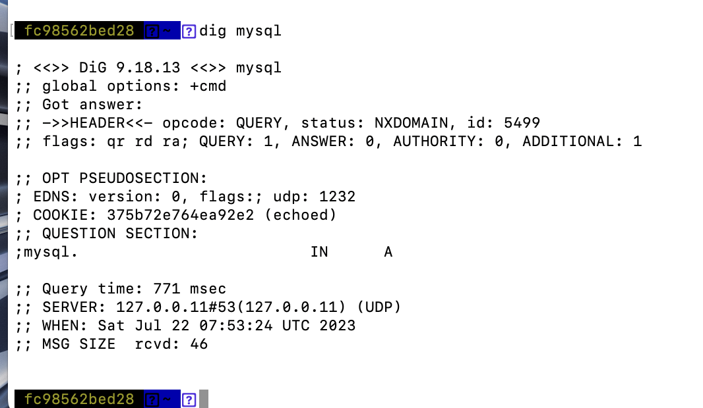

# Docker основы

> На мой взгляд эта технология может упростить жизнь многим разработчикам не зависимо от ЯП, особенно backend-разработчикам, которые переносят проекты с одного ПК на другие ПК и сервера

**Докер(Docker)** - это платформа для разработки, доставки и запуска приложений в контейнерах. Он позволяет упаковывать приложения и все их зависимости в изолированные контейнеры, что обеспечивает более простую и надежную работу программного обеспечения.

Из основных преимуществ технологии предоставляемой Docker хочу выделить:

1. Портабельность - приложения собранные в контейнеры можно запускать на любой совместимой платформе
2. Изолированность - процессы приложений изолируются от процессов на хосте и друг от друга
3. Упрощение развертывания - почти все шаги по развертыванию за вас может выполнять Docker.

### Что такое контейнер и образы(images)?

**Контейнеры** - это исполняемые среды, в которых запускаются приложения и все их необходимые зависимости, такие как библиотеки, инструменты и настройки. Они создают изолированное окружение для приложения, которое работает независимо. При удалении контейнера любые изменения в его состоянии, которые не хранятся в постоянном хранилище, исчезают.

**Образы** - это шаблоны, из которых Docker создает контейнеры. Образ содержит все необходимое для запуска приложения - код, файлы, зависимости, конфигурации и др. Образы создаются на основе `Dockerfile` - специального текстового файла с инструкциями по сборке образа. Созданный образ может быть развернут в контейнеры.

## Контейнеризация приложения

Эта тема на мой взгляд не нуждается в доп. разъяснении тк документация довольно понятно это объясняет <https://docs.docker.com/get-started/02_our_app/>

## Сохранение(монтирование) состояния

Если вы поняли как создавать/использовать образы и контейнеры, стоит поговорить о сохранении состояний между запусками контейнеров. Как правило контейнеры изолированны друг от друга, что не позволяет им взаимодействовать с файлами других контейнеров напрямую и сохранять данные после завершения жизненного цикла. Мы узнаем как хранить данные между запусками и делиться ими с другими контейнерами.

Тома(volumes) - это механизм в Docker, который позволяет создавать и использовать постоянное и изолированное хранилище данных для контейнеров. В отличие от файлов, созданных внутри контейнеров, данные в томах сохраняются даже после остановки и удаления контейнеров. Тома также обеспечивают более эффективное использование дискового пространства и упрощают управление данными при работе с контейнерами.

Том можно создать следующим образом:

```sh
docker volume create VOLUME_NAME
```

Далее этот том можно использовать при запуске приложения, с помощью `--mount` флага:

```sh
docker run -d -p 3000:3000 --mount type=volume,src=VOLUME_NAME,target=/etc/todos IMAGE-NAME
```

- `-d`(--detach) － говорит что нужно запустить контейнер в фоновом режиме
- `-p 3000:3000` － слева указан порт на локальном хосте по которому будет доступен контейнер, а правый параметр указывает на каком порту запустить контейнер в Docker
- `--mount type=volume,src=VOLUME_NAME,target=/etc/myapp/data` － `type=volume` - говорит о том что мы хотим использовать стандартное монтирование, `src=VOLUME_NAME` - тут мы указываем имя нашего тома, `target=/etc/myapp/data` - тут мы указываем данные которые необходимо сохранить в томе

Докер предоставляет еще возможность проинспектировать том:

```sh
docker volume inspect VOLUME_NAME
```

### Сохранение состояния связыванием(bind)

Как вы могли догадаться, если есть `--mount type=volume`, то должен быть и другой тип привязки. Так вот существует привязка `type=bind`, она не создает в docker тома, а использует каталог на вашем устройстве, который вы выбираете сами.

```sh
docker run -d -p 3000:3000 -w /app --mount type=bind,src="$(pwd)",target=/app node:18-alpine sh -c "yarn install && yarn start"
```

> Для windows `docker run -d -p 3000:3000 -w /app --mount "type=bind,src=$pwd,target=/app" node:18-alpine sh -c "yarn install && yarn start"`

`-w /app` - устанавливает рабочий каталог или текущий каталог, из которого будет выполняться команда
`--mount type=bind,src="$(pwd)",target=/app` - привязать текущий каталог с хоста с каталогом /app в контейнере
`node:18-alpine` - представление необходимое для запуска проекта
`sh -c "yarn install && yarn run dev"` - команда запуска проекта

Теперь если вы измените файлы проекта на вашем устройстве, то можете заметить как запущенное в Docker'е приложение будет отражать эти изменения

## Связывание контейнеров

Порой бывает необходимо разделить приложение на контейнеры, данная возможность облегчила бы работу над большим проектом, состоящий из довольно разных частей. Вот некоторые преимущества данного подхода:

- При необходимости масштабировать один модуль вашей программы(например api), не нужно будет взаимодействовать с другими(например БД или какой-либо worker)
- Изолированное управление версиями каждого приложения

Но как сделать так, чтобы отдельно взятые контейнеры могли связаться друг с другом, ведь они изолированные? - Ответом на этот вопрос будет **нетворкинг**, он позволит размещать контейнеры в сетях и даст им возможность общаться друг с другом

Существует два способа поместить контейнер в сеть:

1. Назначьте сеть при запуске контейнера
2. Подключите уже запущенный контейнер к сети

Для начало сеть нужно создать:

```sh
docker network create NETWORK_NAME
```

Далее можем привязать сеть к запущенному контейнеру:

```sh
docker run -d --network NETWORK_NAME --network-alias mysql mysql:8.0
```

Теперь вы можете в других контейнерах общаться с процессом базы данных, по network-alias(псевдониму), команда ниже установит образ который включает в себя множество сетевых утилит:

```sh
docker run -it --network NETWORK_NAME nicolaka/netshoot
```

После загрузки и входа в интерактивный режим вы можете посмотреть инфо о mysql

```sh
dig mysql
```



## Docker compose

**Docker Compose** - это инструмент в экосистеме Docker, который позволяет определять и запускать многоконтейнерные приложения с помощью простого файла конфигурации в формате [YAML](https://yaml.org/spec/1.2.2). С помощью Docker Compose вы можете определить все необходимые компоненты вашего приложения, такие как контейнеры, сети и тома, и запускать их одной командой.

Проверьте что `docker compose` установлен(если не установлен <https://docs.docker.com/compose/install>):

```sh
docker compose version
```

Начнем с того, что создадим `docker-compose.yml` файл в корне проекта, в нем описывается каждый сервис вашего приложения, как отдельный контейнер.

Давайте без занудства сразу рассмотрим и обсудим такой файл:

```yml
services:
  app:
    image: node:18-alpine
    command: sh -c "yarn install && yarn run dev"
    ports:
      - 3000:3000
    working_dir: /app
    volumes:
      - ./:/app
    environment:
      MYSQL_HOST: mysql
      MYSQL_USER: root
      MYSQL_PASSWORD: secret
      MYSQL_DB: todos

  mysql:
    image: mysql:8.0
    volumes:
      - todo-mysql-data:/var/lib/mysql
    environment:
      MYSQL_ROOT_PASSWORD: secret
      MYSQL_DATABASE: todos

volumes:
  todo-mysql-data:
```

Мы создали 2 сервиса:

1. **app**:
   - `image` позволяет указать образ контейнера
   - `command` указывает, какую команду выполнить при запуске контейнера
   - `ports` указывает, что `3000` порт в контейнере будет проксироваться на порт `3000` на хостовой машине
   - `working_dir` переносит файлы текущей директории в папку `app` образа
   - `volumes` позволяет нам использовать связывание состояния(чтобы изменения на локальной машине происходили и в docker контейнере)
   - `environment` позволяет указать переменные окружения для контейнера
2. **mysql**:
   - `volumes` тут уже используется именованные тома для хранения данных базы данных, внизу файла также нужно указать имя тома(в нашем случае `todo-mysql-data`)

Благодаря этому файлу мы теперь можем запускать эти сервисы вместе, используя одну команду:

```sh
docker compose up -d
```

Смотреть логи:

```sh
docker compose logs -f
```

И выключать процессы:

```sh
docker compose down
```
