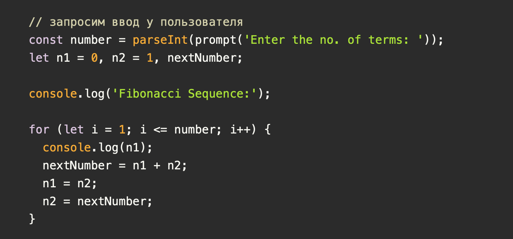
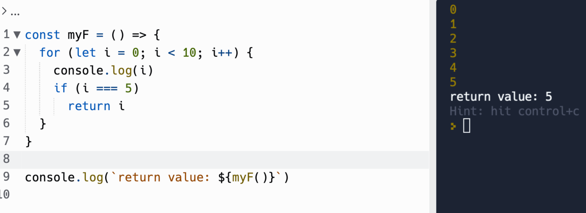
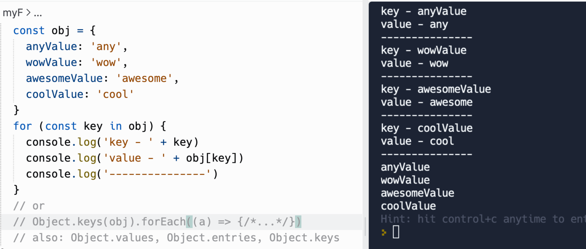
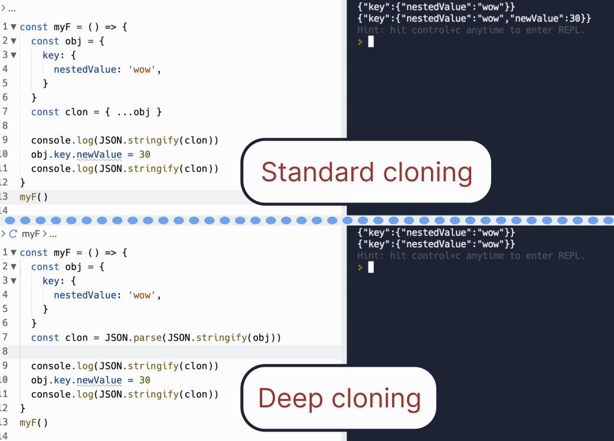
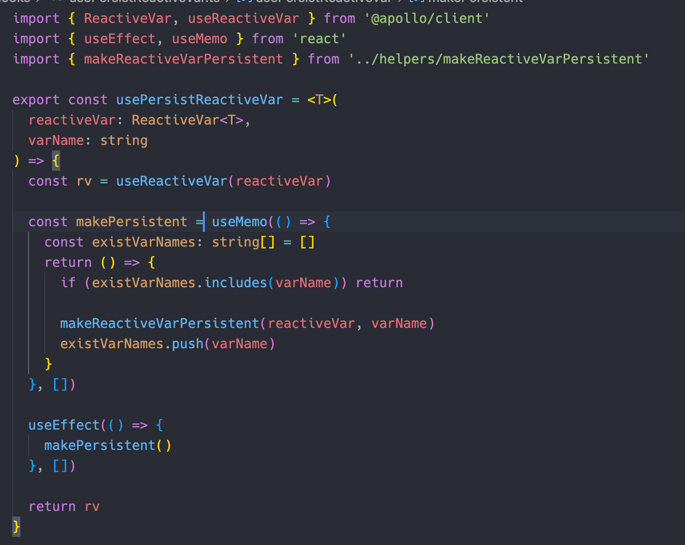
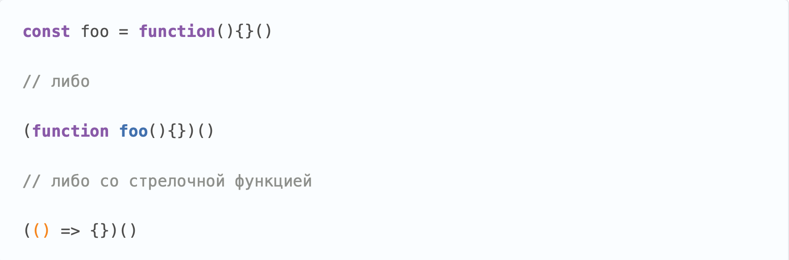
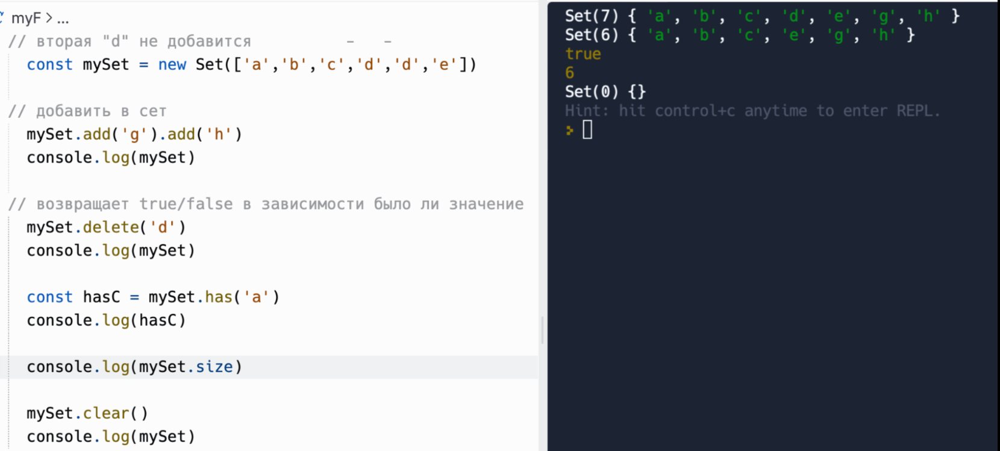
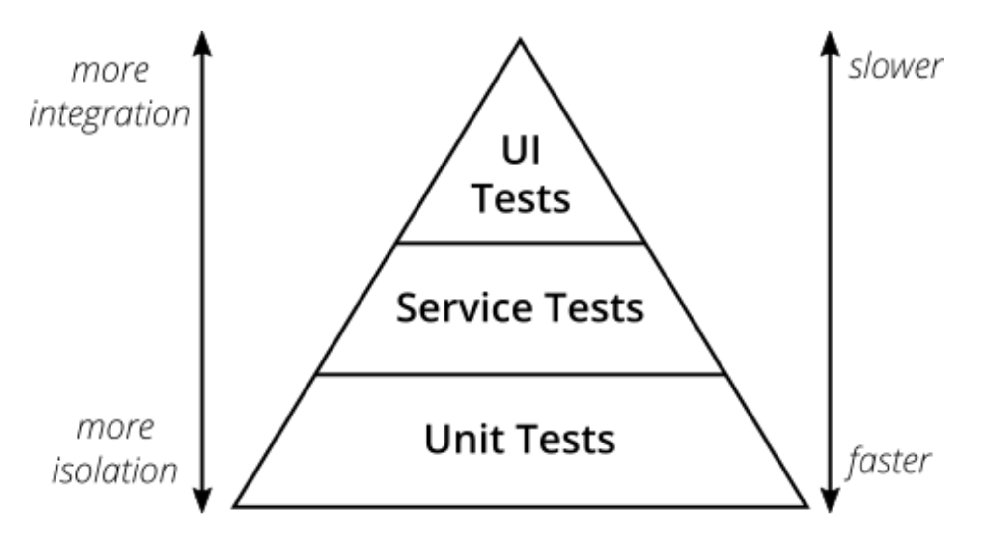

# Список распространенных вопросов по JavaScript.

Этот документ поможет вам в двух случаях:

- Если вы работодатель
- Вы программист, который покинул текущую работу в поисках новой работы, в требования которой входят знания JS

Я понимаю что имея даже большой опыт нельзя помнить наверняка все темы JS, так как многие просто не используются, а некоторые теоретические не применяются в реальных задачах. Но повторение этих тем поможет произвести впечатление на работодателя и покажет ваш уровень ответственности. Я не включал вопросы по темам которые часто используются в практике.

> Список вопросов я рассортировал так, чтобы сложность возрастала вместе с порядковым номером.

### Что такое `NaN` и какова его роль?

- Это специальное значение **«Not a Number»**, которое обычно **говорит о том, что была выполнена бессмысленная операция**
- Его роль в том, чтобы сообщить об ошибке математической операции
- Так же есть функция `isNaN()`, которая проверяет является ли строка не числом

### Что такое примитивные типы данных в JavaScript? Перечислите их.

- Это данные, которые **не являются объектом** и не **имеют методов**.
  <br/>
  <b>Примитивные</b>: <code>bigint, boolean, number, string, symbol, undefined.</code>
  <br/>
  <b>Остальные типы</b>: <code>object, function.</code>

### Какие значения в JS являются ложными?

- `'', 0, null, undefined, NaN, false`

### В чем разница между undefined и is not defined?

- `is not defined` - это **код ошибки** при обращении к несуществующей переменной.
- `undefined` - это значение, присваемое объявленной, но не инициализированной переменной.

### Как проверить, является ли объект массивом?

- Для этого можно использовать встроенный метод `Array.isArray()`.

### Как быстро преобразовать строку в число?

- Можно использовать **унарный +** (например: `const myNum = +myString`), он преобразует строку в число, если это возможно.
- **Унарный -** делает тоже самое, но затем меняет знак результата(`-’20’ => -20`).

### Как динамически добавлять и удалять свойства в JavaScript?

- Вы можете добавить свойство к объекту используя, `myObject.propName = value`, и удалить свойство, используя delete `myObject.propName`.

### Как рассчитать числа Фибоначчи в JavaScript?

- числа Фибоначчи это **последовательность чисел**, где **каждое значение** – это **сумма двух предыдущих.**
- Решение



### Для чего используются операторы break и continue в JavaScript?

- `Break` и continue обеспечивают более точный контроль над выполнением кода в цикле
- `Break` завершает текущую итерацию и **приводит к немедленному выходу из цикла.**
- `Continue` завершает текущую итерацию, но **не останавливает цикл.**
- `Return` работает так же как и break и вдобавок **может вернуть с функции значение остановив выполнение функции.**



### Что такое Рекурсия?

- Это когда алгоритм или **функция вызывает сама себя**.

### Что такое чистые(pure) функции?

- это функции, у которой **возвращаемое значение зависит от передаваемых параметров.**

### Что такое мутабельность / иммутабельность?

- Иммутабельность предполагает, что после создания **данные или структура**, которая их содержит, **не могут быть изменены**.
- Мутабельность означает что **данные могут меняться.**
- \* Например в **redux** используются **чистые функции**(reducers), которые **не меняют состояния**, а **возвращают новый объект**, основываясь на текущем состоянии и действии. Из этого можно сделать вывод, что **редакс иммутабельный.**

### В чем разница между атрибутами и свойствами?

- Атрибут — это начальное состояние в рендеринге DOM, а свойство — это текущее состояние

### Что такое ООП (Объектно-ориентированное программирование) и ФП (функциональное программирование)?

- ООП **основано на концепции объектов**. Это **структуры данных**, **которые содержат поля данных**, известные в JavaScript как свойства, и процедуры, известные как методы (Например: Math с его методами random, max, sin и свойствами такими как PI)
- ФП **основан на концепции чистых функций**, которые избегают общего состояния, изменяемых данных и побочных эффектов.

### Что такое XSS?

- (Cross-Site Scripting —«**межсайтовый скриптинг**»)—довольно распространенная **уязвимость**, которую можно обнаружить на множестве веб-приложений. Ее суть довольно проста, **злоумышленнику удается внедрить на страницу JavaScript-код, который не был предусмотрен разработчиками**

### Что такое чейнинг(chain) функций?

- Это когда мы **у объекта можем вызывать функции по цепочке**, один за другим

```js
obj.add(‘val’).add(‘val2’).delete(‘valN’)
```

### Что такое анонимная функция?

- Функциональное выражение, которое не записывается в переменную, называют анонимной функцией

### Объясните, что означает currying.

- Это трансформация функций таким образом, чтобы они **принимали аргументы не как** f(a, b, c), **а как** f(a)(b)(c). Это **продвинутая техника** для работы с функциями.
- Она **может быть полезной**, когда мы **пишем для callback функцию, в которую нужно помимо event передать еще что-то**:
  `onClick={myCallbackWithUserName(‘vadim’)}`
- Lodash `_.curry(func)` **возвращает каррированную версию функции**, но она также может вызываться func(a, b, c).

### Что делает Object.freeze()?

- `Object.freeze` работает со значениями объектов и **делает объект неизменяемым**, то есть изменить его свойства невозможно.
- \* Можно проверить заморожен ли объект с помощью `Object.isFrozen()`.

### Что такое прототип?

- **Объект, на который указывает ссылка** `__proto__`, называется «прототипом».

### Как записать несколько выражений в одну строку?

- Выражения можно записывать в одну строку **через запятую.**

### Почему результатом сравнения двух похожих объектов является false?

- В отличии от примитивов **объекты сравниваются по ссылке в памяти.**

### Как определить наличие свойства в объекте?

- `(‘propName’ in obj)`
- `obj.hasOwnProperty('propName')`
- `obj['propName']`

### В чем разница между оператором «in» и методом ≪hasOwnProperty≫?

- оператор «_in_» **проверяет наличие свойства** не только в самом объекте, но **и в его прототипах**, а метод _hasOwnProperty_ — **только в объекте**.

### Какие конструкции языка вы используете для обхода объектов?

- `for .. in .. or Object.keys(obj).forEach(…)`



### Как работает Function.prototype.bind()?

- Данный **метод возвращает функцию**, по отношению к которой он вызывается, но **с подмененным контекстом**.

### Что такое hoisting (поднятие) в JavaScript?

- Это механизм в JavaScript, в котором **переменные и объявления функций**, **передвигаются вверх своей области видимости** перед тем, как код будет выполнен
- Стоит отметить то, что механизм «поднятия» передвигает только объявления функции или переменной. **Назначения переменным остаются на своих местах**.

### Как можно клонировать объект? В чем разница глубокого клонирования от поверхностного?

- Можно использовать оператор **spread** `…obj`
- `Object.assign({}, oldObj)`
- `JSON.parse(JSON.stringify(objectToClone))` - этот вариант поддерживает глубокое клонирование
- Разница глубокого клонирования:



### Что такое замыкание в JavaScript? Приведите пример.

- это создание функции и вместе с ней **окружения, к которому она может обращаться**. Это позволяет ей работать с переменным и функциям этого окружения в дальнейшем.
- Есть трюк с хуком `useMemo()` в react связанный с этой темой, так он выглядит:



> Я заметил что я часто нахожу место где useMemo трюк выручает)

### Что такое стрелочная функция и какие ее отличия от обычной?

- Это **краткий способ записи** функциональных выражений.
- Стрелочные функции **не являются конструкторами** (то есть нельзя с помощью `new` создать объект-экземпляр).
- **Не поддерживает** `this` (если быть точнее, то this в стрелочной функции будет ссылаться на this функции снаружи).
- **Отсутствие** `arguments` (`arguments` содержит список аргументов с которым обычная функция была вызвана)
- **Можно кратко вернуть значение** если стрелочная функция выглядит так:
  `const increment = (num) => num + 1`
- **В классах не нужна привязка к this** (то-есть не нужно писать дополнительную функцию bind, например: `batman.logName.bind(batman))`
- Стрелочные функции **не имеют атрибута прототипа.**

### Объясните, что такое файлы cookie в JavaScript.

- Это данные, **хранящиеся в небольших текстовых файлах** на вашем компьютере.
- Куки обычно устанавливаются веб-сервером при помощи заголовка `Set-Cookie`.
- Один из наиболее **частых случаев использования** куки – это **аутентификация**.

### В чем смысл и польза указания `use strict` в начале JavaScript-файла?

- Команда `use strict` включает так называемый **строгий режим**. В этом режиме **предупреждения становятся ошибками.**

### Почему запись function foo(){}() вызывает ошибку и не работает?

- Потому что **вызов декларативной функции** при ее создании **невозможен**, но это можно обойти, если вызов будет следовать за функциональным выражением. Поэтому мы должны либо **прибегнуть к варианту с присвоения к переменной**, либо **обернуть Function Declaration в скобки**, тем **самым превратив её в функциональное выражение.**



### Что такое SPA?

- _Single Page Application_ - это веб-приложение или веб-сайт, использующий **единственный HTML-документ** как оболочку для всех веб-страниц и организующий взаимодействие с пользователем через **динамически подгружаемые HTML, CSS, JavaScript.**

### Что такое функция высшего порядка?

- Это **функция, которая оперирует другими функциями**: принимает их как входные параметры или возвращает в качестве выходных.

### Что произойдет в результате выражения const `foo = 10 + "20"` и почему?

- Переменная foo примет значение "1020"
- В JavaScript(ну и в других ЯП) это поведение называется **приведением типов.**

### Что такое IIFE?

- Immediately Invoked Function Expression — это функция, которая **вызывается и выполняется сразу же после создания** или объявления.

### Почему функции в JS называют объектами первого класса (First-class Objects)?

- Потому что они **обрабатываются также**, **как и любое другое значение** в JS.
- Важным **отличием** функции **является то**, что **функция может быть выполнена или вызвана**.

### Что такое объект Set?

- Объект Set **позволяет хранить уникальные значения**.



### Что выводят эти выражения?

- `false + true => 1` (`false` преобразуется в `0`, а `true` в `1`)
- `6 \* '2' => 12`

### В чем разница между Function Declaration(классическая функция) и Function Expression(функциональное выражение)?

- Их определение выглядит по разному.

**В Function Declaration:** `function funcName () {}`

**В Function Expression:** `const funcName = function () {} or const funcName = () => {}`

- Механизм поднятия в JS не срабатывает для Function Expression.

### Что такое объект Map?

- это **коллекция ключ/значение**, как и `Object`. Но основное отличие в том, что Map позволяет использовать ключи любого типа(даже объекты!)

### Расскажите о пирамиде тестирования.

- Это **один из способов обеспечения качества ПО**, **визуализация**, которая п**омогает группировать тесты** по типу их назначения.



### Что такое temporal dead zone(Временная мертвая зона)?

- Так как js идет сверху вниз, то **переменные**, **которые должны быть определены** ниже, **попадают в мертвую зону**, до того момента **пока они не определятся.**

### Как работает boxing / unboxing в JavaScript?

- Итак, методы – это **свойства объектов**, в которые записаны функции. **Тогда почему работает такой код?** `'hexlet'.toUpperCase()`
- Можно сделать **ошибочный вывод что строка это тоже объект**.
- На самом деле, **для каждого такого типа существует собственный конструктор** "упаковывающий"примитивный тип в объект. выглядит это так:

```js
const name = new String('hexlet'); // or: const name = 'hexlet’.toString()
```

- **Распаковка** в свою очередь **происходит с помощью метода** `valueOf()`, который автоматически вызывает JavaScript и **который можно вызвать самому**.
- В отличии от упаковки, **распаковка выполняется абсолютно для всех объектов**. Это позволяет определять `valueOf()` самостоятельно (этим пользуются многие библиотеки)

### String() vs toString()

- `toString()` не будет работать с `undefined` или `null`, потому что класс этих объектов не реализовал метод `toString()`
- А поскольку String **является независимым объектом**, а не методом, унаследованным от прототипа, то **его можно использовать с объектами, у которых нет метода** `toString()`

###

###

###

###

###

###

###

###

###

###

###

###

###

###

###

###

###

###

###

###

###

###

###

###

###

###

###

###
