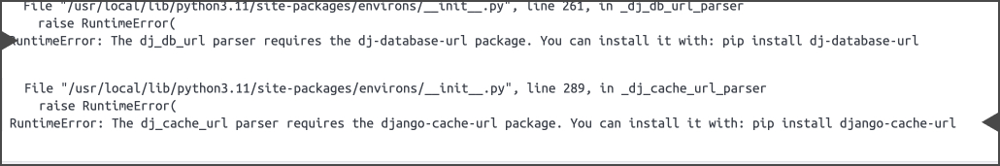

# Переменные окружения проекта

Я решил начать с этой темы, потому что заполнять этот сайт основами django довольно скучная и бессмысленная затея на мой взгляд

И так, что же такое эти **переменные окружения**? Они позволяют нам безопасно разрабатывать проекты, которые имеют открытый исходный код. Их основная идея заключается в централизованном хранении всех секретных и конфигурационных значений для проекта для исключения их утечки в открытые источники. Они применяются в каждом серьезном проекте и обойти эту тему никак не выйдет.

> ≪Вроде простая тема и в статье не нуждается≫ - я считал также, но в отличии от React+JS(где все на мой взгляд очевидно) в ЯП Python выбор правильного инструмента отнял много времени

Из всех библиотек хочу выделить 3 самых крутых:

1. [python-dotenv](https://github.com/theskumar/python-dotenv) - лучше всего подходит для проектов на Python, которые не требует что-то особенного для чтения значений из `.env`. Этот проект имеет больше всего звезд на странице github
2. [django-environ](https://github.com/joke2k/django-environ) - хороший вариант для Django проект. [Ссылка на документацию](https://django-environ.readthedocs.io)

   Он имеет несколько **реальных** преимуществ перед `python-dotenv`:

   - Поддерживает приведение типов переменных окружения(может это делать автоматически)
   - Может преобразовывать `\n` и `\r` в отступы
   - Работа с префиксами(если не хочется писать каждый раз `'MY_PREFIX_'`, когда нужно прочесть переменную)

3. [environs](https://github.com/sloria/environs) - на мой взгляд самая интересная по функционалу библиотека с коротким руководством

   Он имеет тоже несколько преимуществ перед `python-dotenv`:

   - Поддерживает валидацию
   - Также поддерживает приведение типов, но типов здесь больше чем в `django-environ`
   - Есть возможность сделать свою функцию парсинга переменных окружения
   - Работа с префиксами, но на мой взгляд удобнее из за синтаксиса использующего `with`
   - Не зависит от фреймворка(Flask и Django поддерживается), документация может вас запутать, что можно якобы установить `environs[django]`. Я потратил немного времени и проверил это, такой библиотеки нету, django поддерживается из коробки, но вот момент который стоит учесть - если вы хотите использовать функции библиотеки `dj_cache_url()` или `dj_db_url()` то вам отдельно нужно устанавливать пакеты
     
