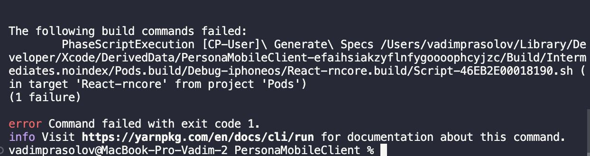
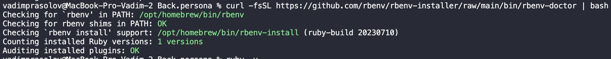

# Apple Silicon и ваши проекты React Native

Данная статья раскрывает нюансы и проблемы при запуске проекта `react-native` на MacOS с arm-процессорами на борту

> Меня побудило написать эту статью долгожданное обновление моего MacBook, тк при настройке у меня возникло множество проблем

В первую очередь нужно обязательно установить homebrew, тут подвохов нету 😌, [официальный сайт с инструкцией](https://brew.sh)

Больше всего мне хочется начать с установки Ruby

## Моя главная ошибка

Я потерял уйму времени потому что назвал папку в которой лежат мои проекты с символом пробела 'React Native' и у меня проект не запускался с такой ошибкой:



## Ruby

Некоторые руководства проинструктируют вас установить Ruby, запустив `brew install ruby` или обновив существующие версии Ruby на macOS, выполнив команду `update ruby mac`. Я рекомендую вам полностью избегать этого.

Манипулировать ruby лучше всего у меня вышло благодаря **rbenv**

## Установка rbenv

Для установки нужных пакетов нужно запустить:

```sh
brew install rbenv ruby-build
rbenv init
```

Затем для корректной работы rbenv необходимо добавить эти строчки в `~/.zprofile`:

> Если этого не сделать то версия ruby будет браться из предустановленной системы, многие руководства утверждают что эти строки нужно добавить в файл `~/.`

```sh
export PATH="$HOME/.rbenv/bin:$PATH"
eval "$(rbenv init - zsh)"
```

Дополнительным шагом можно запустить диагностику установленного rbenv. Проект rbenv располагает официальным инструментом `rbenv-doctor`, который можно запустить с помощью команды:

```sh
curl -fsSL https://github.com/rbenv/rbenv-installer/raw/main/bin/rbenv-doctor | bash
```



> На всякий случай проверьте код по ссылке <https://github.com/rbenv/rbenv-installer/raw/main/bin/rbenv-doctor>

Все подготовительные шаги были выполнены, теперь можно использовать предоставляемый CLI

Получить список стабильных версий для каждой реализации Ruby можно с помощью команды:

```sh
rbenv install --list
```

Список всех версий:

```sh
rbenv install -L
```

Для выбора одной из версий для глобальной установки используется

```sh
rbenv global VERSION
```

Вместо VERSION нужно вписать уже установленную версию ruby, например 3.2.2 (список доступных версий можно получить с помощью команды `rbenv versions`)

## CocoaPods

Его у меня вышло установить только с использованием homebrew

```sh
brew install libffi
brew install cocoapods
```

Если вы установили как-то через gem, то думаю лучше удалить его

```sh
sudo gem uninstall cocoapods
```

## Node и NVM

Я настоятельно рекомендую для установки node использовать nvm, тк он поможет вам переключать версии, что скорее всего пригодиться

Официальное руководство по установке <https://github.com/nvm-sh/nvm/blob/master/README.md#installing-and-updating>

С помощью команды `nvm install VERSION` можно установить какую либо версию node, если написать `nvm install node`, то установиться последняя версия
